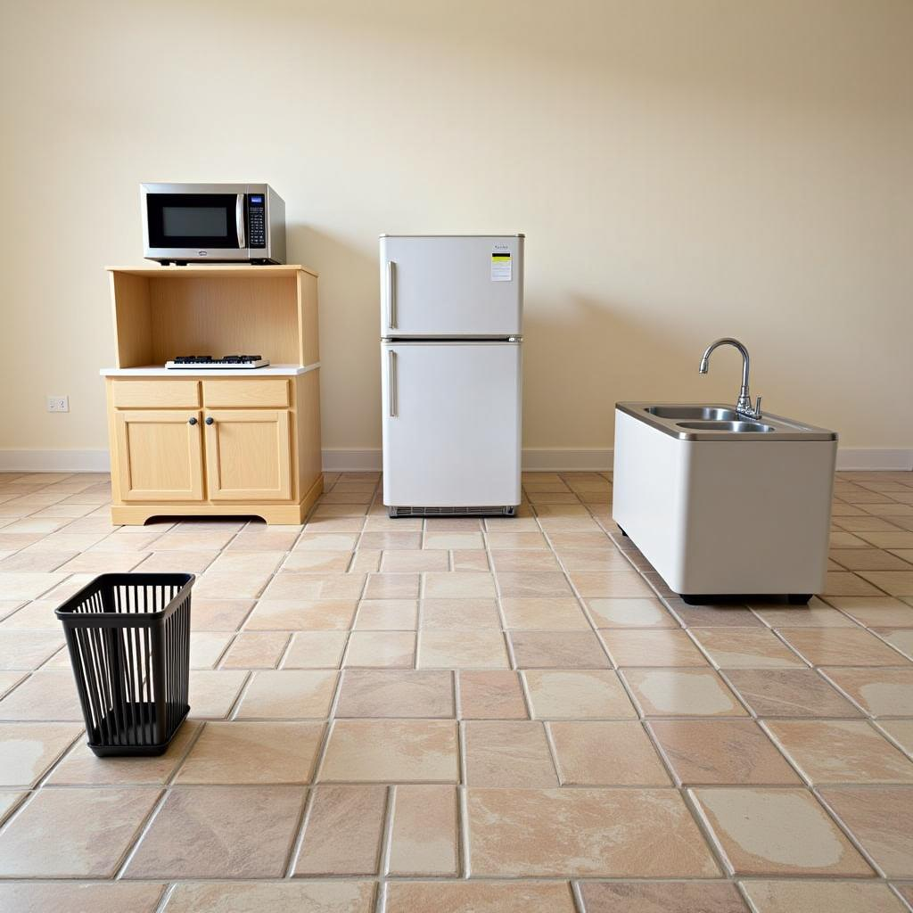
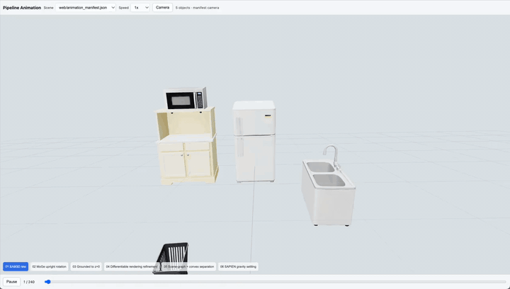
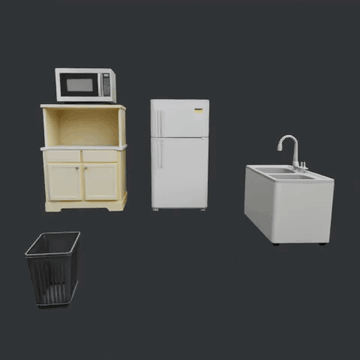
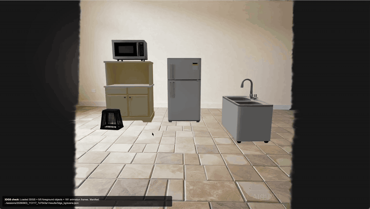

# Fysiverse-3D-SimReady: Agentic Physical Simulation for Pragmatic 3D World Reconstruction

<p align="center">
  <a href="https://fysics-ai.github.io/Fysiverse-3D-project-page/">
    
  </a>
  <a href="">
    
  </a>
</p>


This open-source subset provides the interactive image-to-3D scene generation workflow and the agentic physical simulation runner. The released workflow supports:

- Use the Gradio page to upload an image, annotate objects, run segmentation, and wait for the scene graph.
- Launch 3D scene generation after the scene graph is ready and reconstruct a complete session.
- Generate a 3D Gaussian appearance background for the reconstructed scene.
- Use simulator assistance to convert a scene-specific physical goal into an executable physics rollout.
- Visualize reconstructed scenes, 3DGS backgrounds, and simulation results in the web viewers.

To allow the community to experience our technology as soon as possible, this release combines open-source components with proprietary models accessed through APIs for language reasoning and image completion. We will subsequently integrate our self-developed physics engine and generation model into this system.

## TODO

- [ ] Tech Report Released
- [x] 3DGS background support (2026.9)
- [x] Automatic simulation (2026.9)
- [x] Reconstruction alignment (2026.7)

## Installation and Configuration

Environment setup, third-party repositories and weights, simulation/rendering dependencies, API keys, and main config options are documented in [Installation and Configuration](docs/INSTALL.md).

## Launch

Start the interactive page:

```bash
cd Fysiverse-3D-SimReady
./launch_gradio_app.sh
```

For a custom config file:

```bash
PIPELINE_CONFIG=/absolute/path/to/main.yaml ./launch_gradio_app.sh
```

Open the local URL printed by Gradio.

## UI Workflow

We provide a video for usage at `./assets/usage.mp4`

1. Upload an RGB image in `Input image`.
2. Annotate objects.
   - In `box` mode, click two opposite corners for each object box. **(recommended)**
   - In `point` mode, select foreground/background and click object prompt points.
   - Use `Clear boxes` or `Clear points` to reset prompts.
3. Optionally add a ground prompt in `Ground prompt`. These points help estimate the ground plane.
4. Click `Run Segmentation`.  (around 1 min)
5. Wait for `Scene graph status` to finish. The `Run 3D Inference` button is enabled when the scene graph is ready. (around 3 min)
6. Click `Run 3D Inference`.  (around 5-10 min)
7. Download results from `Output files` and the optional `Pipeline diagnostic animation (.blend)`.

The UI writes each run under `sessions/<session_id>/`. The clean publishable package is in:

```text
sessions/<session_id>/results/release_package/
  final_scene_manifest.json
  blends/
    final_state.blend
    pipeline_animation.blend
  glb/
    final_state.glb
    raw_objects/*.glb
    web_objects/*.glb
  web/
    animation_manifest.json
```

`final_state.glb` is uncompressed and preserves independent object nodes. `raw_objects/*.glb` keeps the original per-object assets, and `web_objects/*.glb` is prepared for browser viewing.

## 3DGS Background Setup

The 3DGS background stage is optional and disabled by default in
`config/background_3dgs.yaml`. It can be launched from the Gradio UI after
`Run 3D Inference`, or from the CLI with `--run-background-3dgs`.

To use it with full quality:

- Configure `background_image.backend` as `seeddream` or `qwen`.
- Provide the matching API key through environment variables or `.env.local`.
- Keep `background_image.local_fallback: false` for quality checks. The local OpenCV fallback is only for smoke tests.
- Install 3DGRUT and keep its `.venv` working inside the 3DGRUT checkout.
- Install GaussianSplats3D and its Node.js dependencies so `util/create-ksplat.js` can export `background.ksplat`.
- Set `dependencies.threedgrut_root` and `dependencies.gaussian_splats_root` if your checkouts are not under `third_party/`.

When rerunning a session, set `FORCE_EDIT=1` if you want to regenerate
`input/background.png` instead of reusing a previous result.

## Agentic Physical Simulation

The simulator assistance module consumes a completed local session and a natural-language physical goal. It writes a scene digest, a simulation plan, and optionally executes the deterministic SAPIEN/Blender runner.

Most users should use the Qwen API through DashScope. This path does not require
a local agent CLI: create an API key in the DashScope console, enable the target
vision-language model service, keep the key out of git, and pass it through
environment variables as described in [API Keys](docs/INSTALL.md#api-keys).

```bash
export SIMULATOR_ASSISTANCE_LLM_BACKEND="dashscope_qwen"
export SIMULATOR_ASSISTANCE_API_BASE_URL="https://dashscope.aliyuncs.com/compatible-mode/v1"
export SIMULATOR_ASSISTANCE_API_MODEL="<your-qwen-vision-model>"
export SIMULATOR_ASSISTANCE_API_KEY="<your-dashscope-api-key>"
```

Advanced users can connect another vision-language API by selecting the generic
`openai_compatible` backend and setting its base URL, model name, and key in the
same environment variables.

The `codex` backend is optional. Use it only if you already have a working local
Codex CLI installation; run `codex login` first and make sure `codex` is
available in `PATH`. API backends do not require this step.

Plan only:

```bash
python3 simulator/run_simulator_assistance.py \
  --session sessions/<session_id> \
  --goal "the trash bin bounces toward the microwave" \
  --mode single \
  --no-run
```

Plan and execute:

```bash
python3 simulator/run_simulator_assistance.py \
  --session sessions/<session_id> \
  --goal "the trash bin bounces toward the microwave" \
  --mode single
```

By default, original-view rendering uses a preview setting of 50 frames, 480 x 480 resolution, and 8 Cycles samples. Override `--render-width`, `--render-height`, `--render-samples`, and `--render-max-frames` for higher quality or full-length videos. Use `--mode single` for API backends. `--mode auto` may choose the parallel
Planner/Reasoner/Builder decomposition for larger scenes; that mode is best used
with the `codex` backend or after verifying that your API model reliably returns
strict JSON for each subtask.

The runner expects the full local session under `sessions/<session_id>/`, including collision assets referenced by `results/final_scene_manifest.json`. The lightweight `release_package/` is intended for web viewing and does not necessarily contain all runner inputs. Do not commit API keys.

## Web View

Serve the `Fysiverse-3D-SimReady` directory with a static file server:

```bash
cd Fysiverse-3D-SimReady

python -m http.server 8080
```

Open the final scene viewer:

```text
http://localhost:8080/project_page/index.html?manifest=../sessions/<session_id>/results/release_package/final_scene_manifest.json&autoload=1
```

Open the lightweight pipeline animation viewer:

```text
http://localhost:8080/web_preview/pipeline_animation/index.html?session=<session_id>&cameraOverride=manifest
```

Do not open `animation_manifest.json` directly; it is the data file consumed by the preview viewer.

After `Run 3D Inference` finishes in Gradio, click `Run 3DGS Background` to
generate the appearance background. The stage writes
`results/3dgs_bg/background.ksplat`, `scene.json`, and `manifest.json`, and
records those paths in `results/final_scene_manifest.json`.

Open the optional 3DGS hybrid viewer:

```bash
./launch_3dgs_check_server.sh 18080 127.0.0.1
```

```text
http://127.0.0.1:18080/project_page/3dgs_check.html?manifest=../sessions/<session_id>/results/3dgs_bg/scene.json
```

The same 3DGS hybrid viewer can replay a simulation sequence over the Gaussian
background by adding a `sequence` query parameter:

```text
http://127.0.0.1:18080/project_page/3dgs_check.html?manifest=../sessions/<session_id>/results/3dgs_bg/scene.json&sequence=<trajectory_json>&speed=0.7
```

Here `<trajectory_json>` should point to a trajectory file produced by the
gravity settling or agentic simulation runner, such as a `pose_trajectory.json`
file under the current session results directory.

### Visualization Demo

The repository includes one lightweight kitchen demo under `assets/demo/kitchen_3dgs/`.
The demo follows the full visualization order:

`input image` -> `reconstruction process` -> `simulator-only rollout` -> `3DGS hybrid simulation`

<table>
  <tr>
    <td align="center" width="50%">
      <strong>1. Input Image</strong><br><br>
      
    </td>
    <td align="center" width="50%">
      <strong>2. Reconstruction Process</strong><br><br>
      <br>
      <sub><a href="assets/demo/kitchen_3dgs/reconstruction_process.mp4">Open MP4</a></sub>
    </td>
  </tr>
  <tr>
    <td align="center" width="50%">
      <strong>3. Simulator-Only Rollout</strong><br><br>
      <br>
      <sub><a href="assets/demo/kitchen_3dgs/simulator_output_no_background.mp4">Open MP4</a></sub>
    </td>
    <td align="center" width="50%">
      <strong>4. 3DGS Hybrid Simulation</strong><br><br>
      <br>
      <sub><a href="assets/demo/kitchen_3dgs/hybrid_3dgs_simulation.mp4">Open MP4</a></sub><br>
      <sub>The "AI-generated" watermark appears because the inpainting stage calls a proprietary image-completion API.</sub>
    </td>
  </tr>
</table>

More visualization results are available on our [interactive project page](https://fysics-ai.github.io/Fysiverse-3D-project-page/).

For CLI usage, pass `--run-background-3dgs` to `app.py` or set `enabled: true`
in `config/background_3dgs.yaml`.

For quality checks, keep `background_image.local_fallback: false` and set
`FORCE_EDIT=1` when rerunning a session that may already contain
`input/background.png` from a previous local fallback. The local OpenCV inpaint
fallback can be enabled with `BACKGROUND_LOCAL_FALLBACK=1`, but it is only meant
for smoke tests because it usually gives a much weaker 3DGS background.

Replace `<session_id>` with the session directory shown in the Gradio page. The final scene viewer loads packaged GLB assets and browser-side rigid-body controls.
