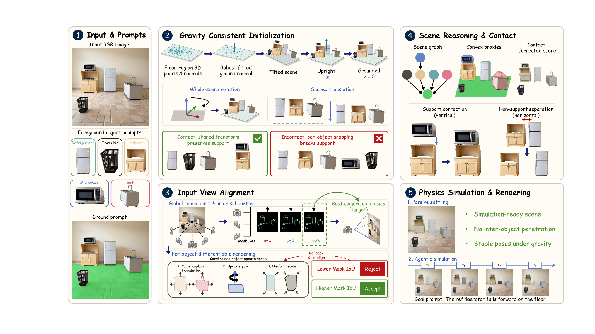

# Fysiverse-3D-SimReady: Agentic Physical Simulation for Pragmatic 3D World Reconstruction

---

<div align="center">
  <a href="https://fysics-ai.github.io/Fysiverse-3D-project-page/">
    
  </a>
  <a href="">
    
  </a>
  <br>
  
</div>

This open-source subset provides the interactive image-to-3D scene generation workflow and the agentic physical simulation runner. Use the Gradio page to upload an image, annotate objects, run segmentation, wait for the scene graph, and launch 3D scene generation. After a session is reconstructed, use simulator assistance to convert a scene-specific physical goal into an executable physics rollout.

To allow the community to experience our technology as soon as possible, the version we are currently releasing is built on top of open-source models. We will subsequently integrate our self-developed physics engine and generation model into this system.

## Environment

Create a new conda environment for this package. The installer does not modify existing conda environments, system CUDA, or NVIDIA drivers, and it does not download model weights.

```bash
cd Fysiverse-3D-SimReady
CONDA_BIN=conda scripts/setup_conda_env.sh
conda activate fysiverse-scene
```

PyTorch is installed from the official CUDA wheel index. Other Python packages are installed with `uv pip` from the Tsinghua mirror by default.

Install these external executables outside conda:

- Blender 4.5.4. Set `pipeline.blender_bin` in `config/main.yaml` to `blender` or the absolute Blender binary path.
- `gltfpack` for compressed browser GLBs. If unavailable, the exporter can fall back to `gltf-transform` when configured.

The setup script installs the Python packages used by reconstruction,
postprocessing, SAPIEN simulation, CoACD collision preparation, the Gradio UI,
and API clients. It does not download third-party repositories or model
weights.

## Third-Party Code and Weights

Place the third-party repositories and weights under the default paths below,
or point `config/main.yaml` and `config/background_3dgs.yaml` to your own local
locations. The default layout is:

```text
Fysiverse-3D-SimReady/
  third_party/
    Grounded-SAM-2/
    SAM3D/
    MoGe/
    3dgrut/                 # optional, only for 3DGS background
    GaussianSplats3D/       # optional, only for 3DGS background export
  checkpoints/
    moge-2-vitl-normal/
      model.pt
```

| Component | Used for | Default location | Required files | Config or environment override |
| --- | --- | --- | --- | --- |
| Grounded-SAM-2 | Object and ground segmentation | `third_party/Grounded-SAM-2` | `checkpoints/sam2.1_hiera_large.pt`, `gdino_checkpoints/groundingdino_swint_ogc.pth`, and the bundled `sam2/` and `grounding_dino/` packages | `paths.gsam2_root` or `GSAM2_ROOT` |
| SAM3D | Per-object 3D asset reconstruction | `third_party/SAM3D` | SAM3D source tree and `runtime_configs/pipeline_hf_cache_moge_modelpt.yaml` | `paths.sam3d_root`, `paths.sam3d_config`, `SAM3D_ROOT`, or `SAM3D_CONFIG` |
| SAM3D Python env | Optional isolated SAM3D runtime | active conda env | `bin/python` if a separate env is used | `paths.sam3d_env_dir`, `SAM3D_ENV_DIR`, or `SAM3D_PYTHON` |
| MoGe | Monocular geometry, gravity alignment, and pose refinement | `third_party/MoGe` | MoGe source tree | `paths.moge_root` or `MOGE_ROOT` |
| MoGe checkpoint | MoGe inference | `checkpoints/moge-2-vitl-normal/model.pt` | local checkpoint file | `paths.moge_ckpt` or `MOGE_CKPT` |
| 3DGRUT | Optional single-image 3DGS background training | `third_party/3dgrut` | `train_diy.py` and a working `.venv` inside the 3DGRUT checkout | `dependencies.threedgrut_root` or `THREEDGRUT_ROOT` |
| GaussianSplats3D | Optional KSplat export for browser viewing | `third_party/GaussianSplats3D` | `util/create-ksplat.js` and Node.js dependencies required by that project | `dependencies.gaussian_splats_root` or `GAUSSIAN_SPLATS_ROOT` |

Grounded-SAM-2 should be installed according to its upstream instructions so
that both SAM2 and GroundingDINO can be imported from the selected
`GSAM2_ROOT`. SAM3D and MoGe should likewise be installed according to their
upstream requirements. If you want `scripts/setup_conda_env.sh` to try editable
installs for repositories already placed in `third_party/`, run:

```bash
INSTALL_EDITABLE_THIRD_PARTY=1 CONDA_BIN=conda scripts/setup_conda_env.sh
```

Keep `third_party/`, `checkpoints/`, local sessions, logs, and `.env.local` out
of git.

## Simulation and Rendering Runtime

SAPIEN and CoACD Python packages are installed by `scripts/setup_conda_env.sh`.
The reconstruction pipeline uses SAPIEN for gravity settling and simulation,
CoACD or convex hulls for collision proxies, and Blender for applying poses,
writing `.blend` files, and rendering original-view videos.

Before launching, check:

- `blender` is available in `PATH`, or set `pipeline.blender_bin` in `config/main.yaml`.
- `deterministic_runner.blender_bin` in `config/simulator_assistance.yaml` points to the same Blender executable when running agentic simulation.
- `pipeline.conda_env`, `moge.nvdiffrast.env`, `collision.coacd.env`, `sapien.env`, and `simulator_assistance.deterministic_runner.conda_env` refer to environments that exist on your machine. The default is `fysiverse-scene`.
- `gltfpack` or a configured `gltf-transform` fallback is available if you want compressed browser assets.

## API Keys

No API key is required for local segmentation, 3D asset reconstruction,
geometry alignment, collision correction, or SAPIEN settling. API keys are only
needed for language or image-editing stages:

| Stage | Required when | Variables |
| --- | --- | --- |
| Scene graph VLM | `features.scene_graph: true` | `SCENE_GRAPH_BACKEND`, `SCENE_GRAPH_API_BASE_URL`, `SCENE_GRAPH_API_MODEL`, `SCENE_GRAPH_API_KEY` |
| 3DGS background image completion with Seedream | Running `Run 3DGS Background` with `background_image.backend: seeddream` | `ARK_API_KEY` or `BACKGROUND_IMAGE_SEEDDREAM_API_KEY` |
| 3DGS background image completion with Qwen Image | Running `Run 3DGS Background` with `background_image.backend: qwen` | `QWEN_IMAGE_API_KEY` or `DASHSCOPE_API_KEY` |
| Agentic physical simulation | Running `simulator/run_simulator_assistance.py` with an API backend | `SIMULATOR_ASSISTANCE_LLM_BACKEND`, `SIMULATOR_ASSISTANCE_API_BASE_URL`, `SIMULATOR_ASSISTANCE_API_MODEL`, `SIMULATOR_ASSISTANCE_API_KEY` |

You can export keys in the shell before launching, or create an untracked
`.env.local` file in the repository root. `launch_gradio_app.sh` loads
`.env.local` automatically when it exists.

Example DashScope setup for scene graph and simulator assistance:

```bash
export SCENE_GRAPH_BACKEND="dashscope_qwen"
export SCENE_GRAPH_API_BASE_URL="https://dashscope.aliyuncs.com/compatible-mode/v1"
export SCENE_GRAPH_API_MODEL="<your-qwen-vision-model>"
export SCENE_GRAPH_API_KEY="<your-dashscope-api-key>"

export SIMULATOR_ASSISTANCE_LLM_BACKEND="dashscope_qwen"
export SIMULATOR_ASSISTANCE_API_BASE_URL="https://dashscope.aliyuncs.com/compatible-mode/v1"
export SIMULATOR_ASSISTANCE_API_MODEL="<your-qwen-vision-model>"
export SIMULATOR_ASSISTANCE_API_KEY="<your-dashscope-api-key>"
```

Example Seedream setup for the optional 3DGS background image completion stage:

```bash
export BACKGROUND_IMAGE_BACKEND="seeddream"
export BACKGROUND_IMAGE_SEEDDREAM_API_KEY="<your-seeddream-or-ark-api-key>"
```

## Configuration

Edit `config/main.yaml` first:

- `pipeline.workflow_root`: leave blank to use this checkout directory, or set an absolute path when launching from another location.
- `pipeline.conda_bin`: conda executable, for example `conda` or `/absolute/path/to/conda`.
- `pipeline.conda_env`: the new environment name created above.
- `pipeline.blender_bin`: Blender 4.5.4 executable.
- `server.name`, `server.port`: Gradio bind address and preferred port.
- `paths.*`: local roots and checkpoint paths for GSAM2, SAM3D, and MoGe.
- `features.scene_graph`: keep `true` for the normal interactive flow.
- `module_configs.background_3dgs`: optional 3DGS background reconstruction after the foreground scene has been aligned and settled.

Then review the module configs in `config/`. Each field has a short comment describing what it changes and when to adjust it.

Keep real API keys out of git. The setup script should not contain API keys.

For a quick configuration sanity check:

```bash
python3 scripts/load_pipeline_config.py --config config/main.yaml
```

This command prints the environment variables that will be exported by the
launcher. It should not print any real API key unless you intentionally put one
in your local shell or untracked `.env.local`.

## Launch

Start the interactive page:

```bash
cd Fysiverse-3D-SimReady
./launch_gradio_app.sh
```

For a custom config file:

```bash
PIPELINE_CONFIG=/absolute/path/to/main.yaml ./launch_gradio_app.sh
```

Open the local URL printed by Gradio.

## UI Workflow

We provide a video for usage at `./assets/usage.mp4`

1. Upload an RGB image in `Input image`.
2. Annotate objects.
   - In `box` mode, click two opposite corners for each object box. **(recommended)**
   - In `point` mode, select foreground/background and click object prompt points.
   - Use `Clear boxes` or `Clear points` to reset prompts.
3. Optionally add a ground prompt in `Ground prompt`. These points help estimate the ground plane.
4. Click `Run Segmentation`.  (around 1 min)
5. Wait for `Scene graph status` to finish. The `Run 3D Inference` button is enabled when the scene graph is ready. (around 3 min)
6. Click `Run 3D Inference`.  (around 5-10 min)
7. Download results from `Output files` and the optional `Pipeline diagnostic animation (.blend)`.

The UI writes each run under `sessions/<session_id>/`. The clean publishable package is in:

```text
sessions/<session_id>/results/release_package/
  final_scene_manifest.json
  blends/
    final_state.blend
    pipeline_animation.blend
  glb/
    final_state.glb
    raw_objects/*.glb
    web_objects/*.glb
  web/
    animation_manifest.json
```

`final_state.glb` is uncompressed and preserves independent object nodes. `raw_objects/*.glb` keeps the original per-object assets, and `web_objects/*.glb` is prepared for browser viewing.

## 3DGS Background Setup

The 3DGS background stage is optional and disabled by default in
`config/background_3dgs.yaml`. It can be launched from the Gradio UI after
`Run 3D Inference`, or from the CLI with `--run-background-3dgs`.

To use it with full quality:

- Configure `background_image.backend` as `seeddream` or `qwen`.
- Provide the matching API key through environment variables or `.env.local`.
- Keep `background_image.local_fallback: false` for quality checks. The local OpenCV fallback is only for smoke tests.
- Install 3DGRUT and keep its `.venv` working inside the 3DGRUT checkout.
- Install GaussianSplats3D and its Node.js dependencies so `util/create-ksplat.js` can export `background.ksplat`.
- Set `dependencies.threedgrut_root` and `dependencies.gaussian_splats_root` if your checkouts are not under `third_party/`.

When rerunning a session, set `FORCE_EDIT=1` if you want to regenerate
`input/background.png` instead of reusing a previous result.

## Web View

Serve the `Fysiverse-3D-SimReady` directory with a static file server:

```bash
cd Fysiverse-3D-SimReady

python -m http.server 8080
```

Open the final scene viewer:

```text
http://localhost:8080/project_page/index.html?manifest=../sessions/<session_id>/results/release_package/final_scene_manifest.json&autoload=1
```

Open the lightweight pipeline animation viewer:

```text
http://localhost:8080/web_preview/pipeline_animation/index.html?session=<session_id>&cameraOverride=manifest
```

Do not open `animation_manifest.json` directly; it is the data file consumed by the preview viewer.

After `Run 3D Inference` finishes in Gradio, click `Run 3DGS Background` to
generate the appearance background. The stage writes
`results/3dgs_bg/background.ksplat`, `scene.json`, and `manifest.json`, and
records those paths in `results/final_scene_manifest.json`.

Open the optional 3DGS hybrid viewer:

```bash
./launch_3dgs_check_server.sh 18080 127.0.0.1
```

```text
http://127.0.0.1:18080/project_page/3dgs_check.html?manifest=../sessions/<session_id>/results/3dgs_bg/scene.json
```

For CLI usage, pass `--run-background-3dgs` to `app.py` or set `enabled: true`
in `config/background_3dgs.yaml`.

For quality checks, keep `background_image.local_fallback: false` and set
`FORCE_EDIT=1` when rerunning a session that may already contain
`input/background.png` from a previous local fallback. The local OpenCV inpaint
fallback can be enabled with `BACKGROUND_LOCAL_FALLBACK=1`, but it is only meant
for smoke tests because it usually gives a much weaker 3DGS background.

Replace `<session_id>` with the session directory shown in the Gradio page. The final scene viewer loads packaged GLB assets and browser-side rigid-body controls.

## Agentic Physical Simulation

The simulator assistance module consumes a completed local session and a natural-language physical goal. It writes a scene digest, a simulation plan, and optionally executes the deterministic SAPIEN/Blender runner.

Most users should use the Qwen API through DashScope. This path does not require
a local agent CLI: create an API key in the DashScope console, enable the target
vision-language model service, keep the key out of git, and pass it through
environment variables as described in [API Keys](#api-keys).

```bash
export SIMULATOR_ASSISTANCE_LLM_BACKEND="dashscope_qwen"
export SIMULATOR_ASSISTANCE_API_BASE_URL="https://dashscope.aliyuncs.com/compatible-mode/v1"
export SIMULATOR_ASSISTANCE_API_MODEL="<your-qwen-vision-model>"
export SIMULATOR_ASSISTANCE_API_KEY="<your-dashscope-api-key>"
```

Advanced users can connect another vision-language API by selecting the generic
`openai_compatible` backend and setting its base URL, model name, and key in the
same environment variables.

The `codex` backend is optional. Use it only if you already have a working local
Codex CLI installation; run `codex login` first and make sure `codex` is
available in `PATH`. API backends do not require this step.

Plan only:

```bash
python3 simulator/run_simulator_assistance.py \
  --session sessions/<session_id> \
  --goal "the trash bin bounces toward the microwave" \
  --mode single \
  --no-run
```

Plan and execute:

```bash
python3 simulator/run_simulator_assistance.py \
  --session sessions/<session_id> \
  --goal "the trash bin bounces toward the microwave" \
  --mode single
```

By default, original-view rendering uses a preview setting of 50 frames, 480 x 480 resolution, and 8 Cycles samples. Override `--render-width`, `--render-height`, `--render-samples`, and `--render-max-frames` for higher quality or full-length videos. Use `--mode single` for API backends. `--mode auto` may choose the parallel
Planner/Reasoner/Builder decomposition for larger scenes; that mode is best used
with the `codex` backend or after verifying that your API model reliably returns
strict JSON for each subtask.

The runner expects the full local session under `sessions/<session_id>/`, including collision assets referenced by `results/final_scene_manifest.json`. The lightweight `release_package/` is intended for web viewing and does not necessarily contain all runner inputs. Do not commit API keys.
